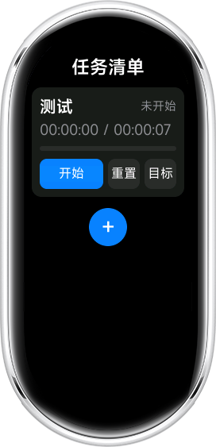
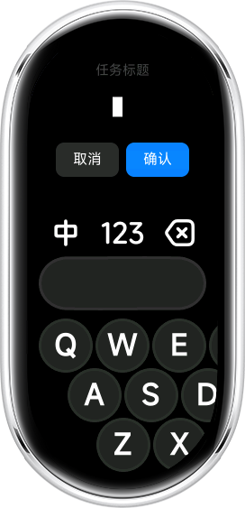
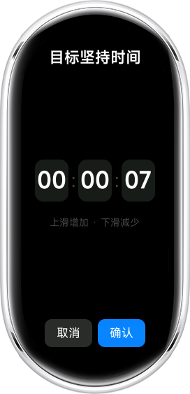

<div align="center">


# 时间管理 TimeManager

**在小米手环 10 上以「天」为单位管理任务与坚持时间。**

<!-- 徽章按需保留，没有对应内容的直接删掉 -->


</div>

## 简介

<!-- 待写：2~3 段，回答三个问题
     1. 它解决什么问题？
     2. 给谁用、在什么场景下用？
     3. 和同类做法相比，特点是什么？ -->

## 功能特性

<!-- 待写：一个功能一行，说清「能做什么」而不是「怎么实现」 -->

- **任务清单**：以天为单位管理若干任务，支持新增、编辑
- **目标时间**：自定义每个任务的时分秒目标
- **秒表计时**：开始 / 暂停 / 继续 / 重置，实时查看已坚持时间
- **每日重置**：每天凌晨自动将任务状态刷新为「未开始」
- **本地持久化**：数据存于设备本地，无需网络

## 界面预览

| 主页 | 新增任务 | 目标时间 |
| :---: | :---: | :---: |
|  |  |  |

## 技术栈

| 项目 | 说明 |
| --- | --- |
| 运行平台 | 小米手环 10（1.72" AMOLED，212 × 520）/ Vela OS |
| 应用框架 | Vela 快应用（`.ux` 单文件组件，类 Vue 语法） |
| 构建工具 | `aiot-toolkit`（产物 `dist/*.rpk`） |
| 语言 | JavaScript (ES2015+)，无 TypeScript 构建链 |
| 代码规范 | ESLint + Prettier + Stylelint + husky + commitlint |

## 目录结构

```
TimeManager/
├── src/
│   ├── pages/           页面：index / task-edit / task-target / task-title
│   ├── component/       公共组件：time-picker、InputMethod
│   ├── utils/           工具：model / storage / store / time
│   ├── i18n/            多语言：defaults / en / zh-CN
│   ├── common/          静态资源（logo 等）
│   ├── app.ux           应用入口
│   └── manifest.json    应用配置：包名、路由、平台能力声明
├── design.md            需求与界面设计
├── architecture.md      架构设计文档
└── husky.sh             代码规范化钩子安装脚本
```

## 快速上手

### 环境要求

```
Node.js >= 8.10
npm
```

### 1. 开发

```
npm install
npm run start
```

### 2. 构建

```
npm run build
npm run release
```

### 3. 代码检查

```
npm run lint
```

## 相关文档

- [需求与界面设计](./design.md)
- [架构设计](./architecture.md)

## 许可证

[MIT](LICENSE)
