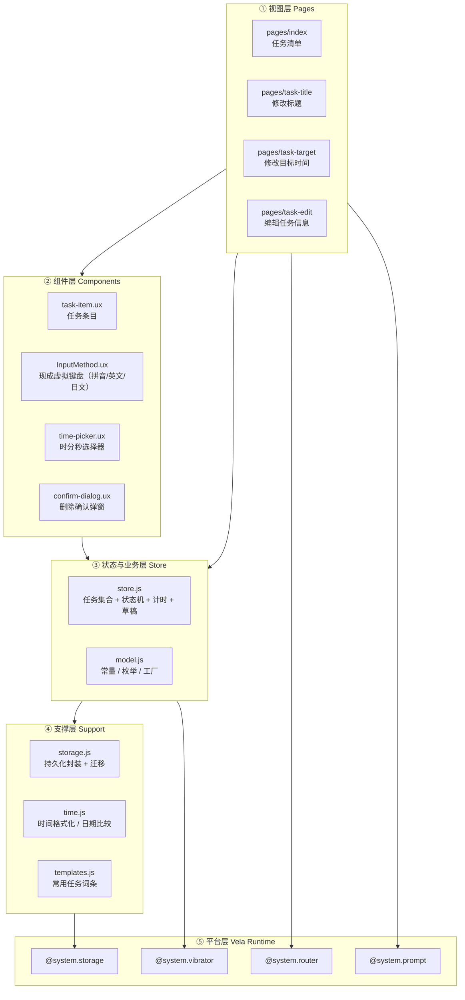
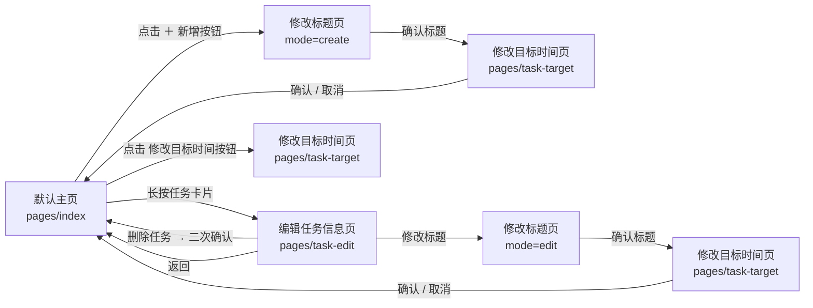
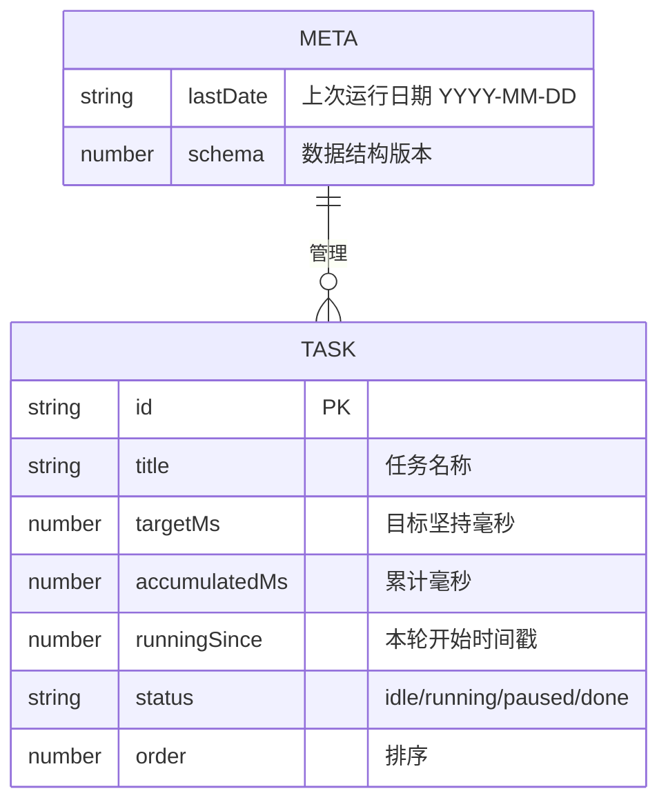
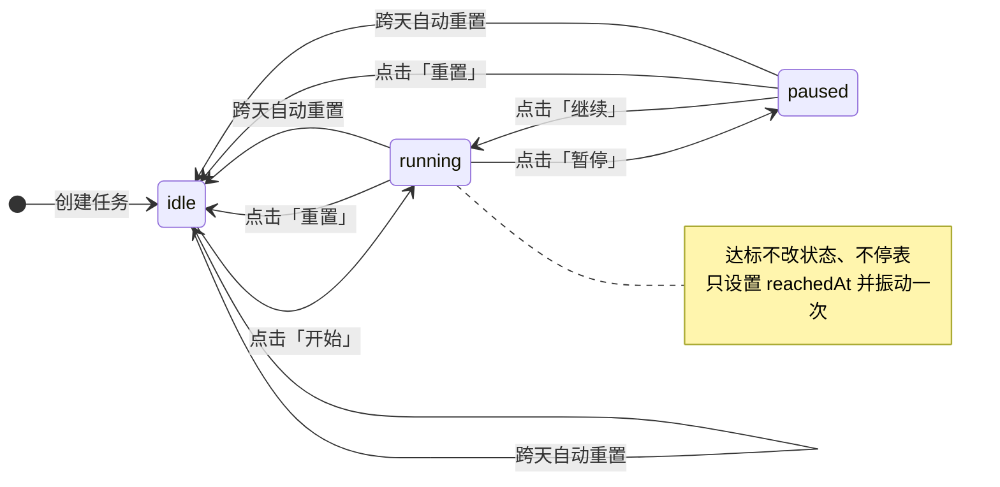
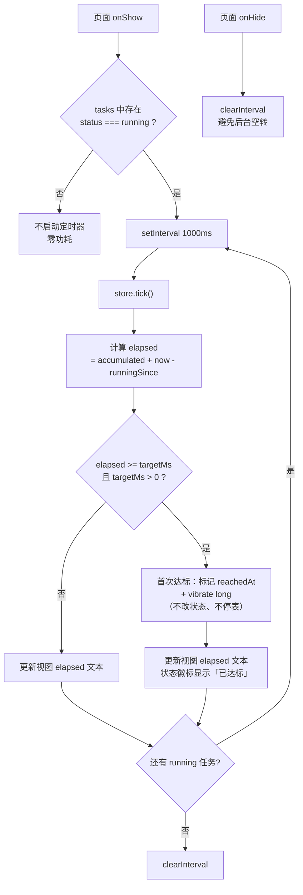
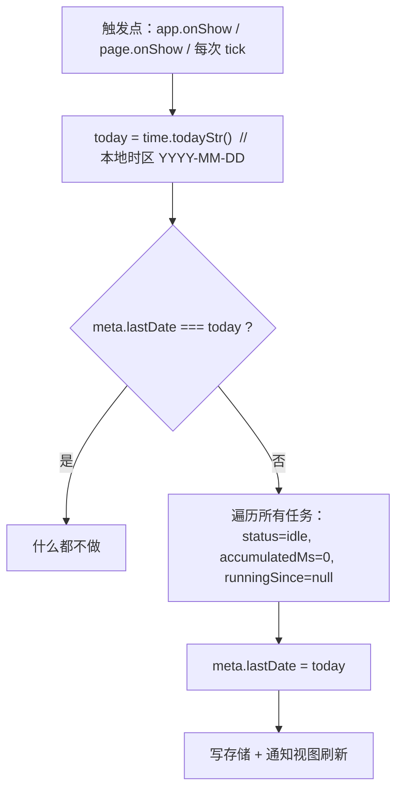
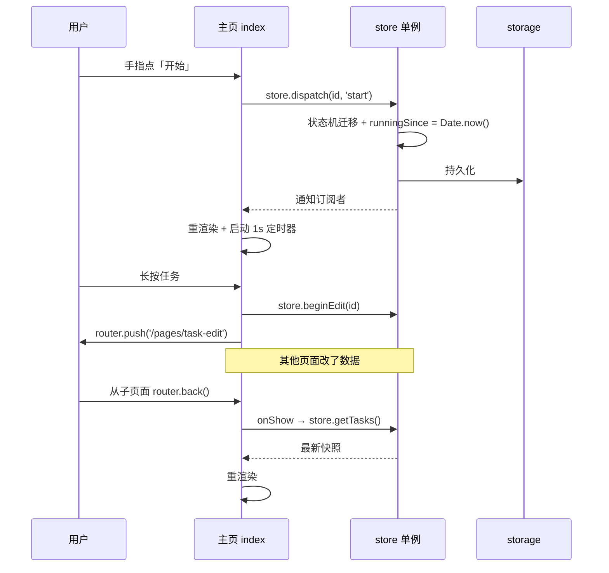
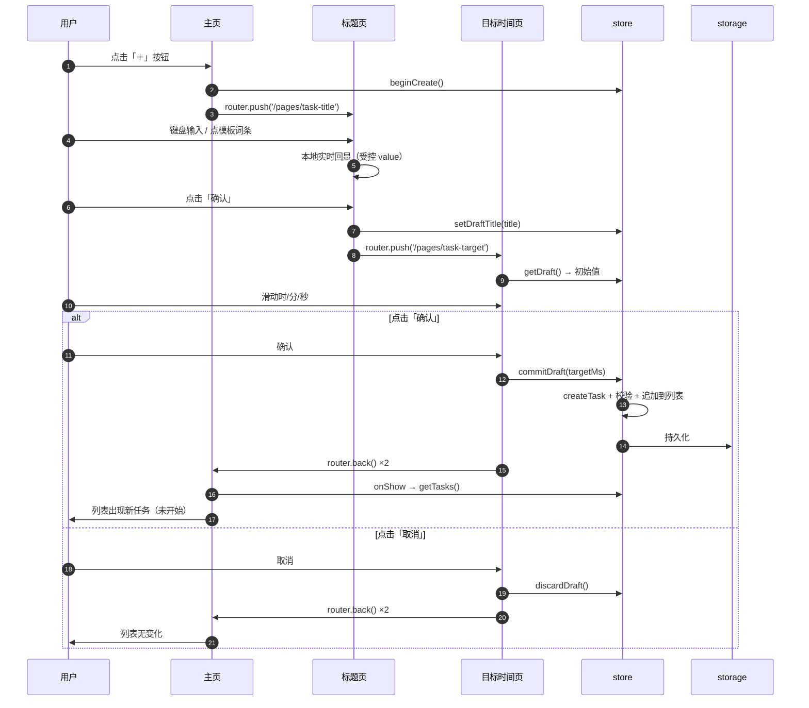
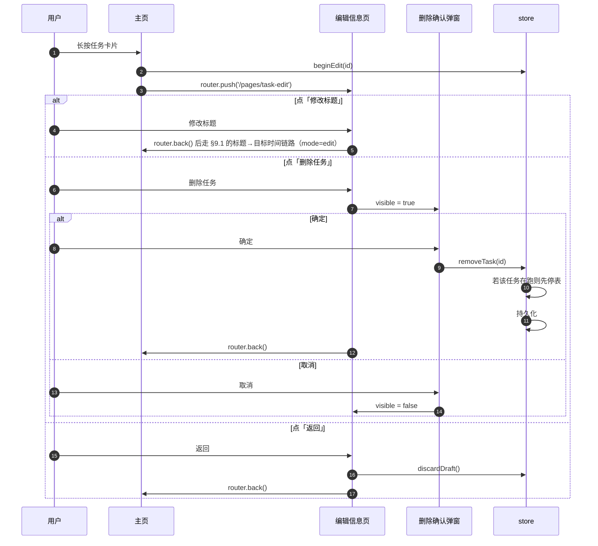
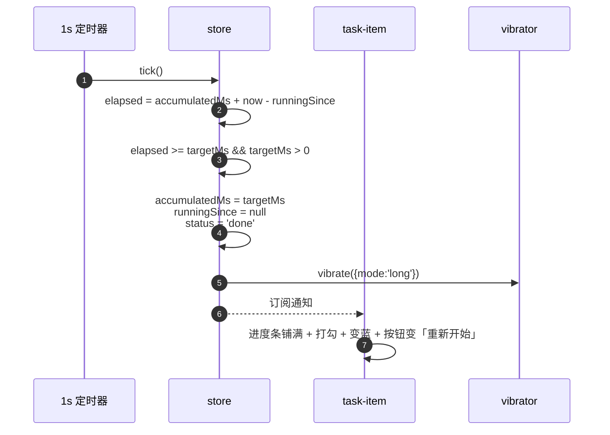

# TimeManager 架构设计文档

> 本文档描述「每日目标坚持时间管理」快应用的完整技术设计。
> 需求来源：[design.md](./design.md)；本文档只做设计，不含实现代码。
> 目标读者：参与本项目的开发者（含未来的自己）。

---

## 1. 项目概述

### 1.1 一句话定位

一个运行在**小米手环 10** 上的 **Vela 快应用**：以「天」为单位管理若干个「任务」，每个任务记录**目标坚持时间**与**已坚持时间**，并提供开始 / 暂停 / 继续 / 重置的秒表式交互。

### 1.2 运行平台与技术栈

| 项目 | 取值 | 说明 |
| --- | --- | --- |
| 设备 | 小米手环 10 | 1.72" AMOLED，**212 × 520 px**，60Hz |
| 系统 | Xiaomi HyperOS / Vela OS | 快应用运行时 |
| 框架 | Vela 快应用（类小程序） | `.ux` 单文件组件 = `template` + `script` + `style` |
| 构建 | `aiot-toolkit` (`aiot start` / `aiot build`) | 产物 `dist/*.rpk` |
| 语言 | JavaScript (ES2015+) + 类 Vue 模板语法 | 无 TypeScript 构建链 |

### 1.3 可用平台能力（`@system.*`）

| 模块 | 用途 | manifest `features` 是否需声明 |
| --- | --- | --- |
| `@system.router` | 页面跳转 / 返回 / 页面栈 | 需要（已有） |
| `@system.storage` | 本地持久化（KV，值为字符串） | 需要（**待加**） |
| `@system.prompt` | Toast / 原生弹窗 | 需要（**待加**） |
| `@system.vibrator` | 触感反馈（`vibrate({mode:'short'\|'long'})`） | 需要（**待加**） |
| `@system.brightness` | 亮度（可选，暂不用） | 需要（可选） |

> 注意：Vela 快应用**没有 DOM**，不要使用 `document.*`（现有 [index.ux](src/pages/index/index.ux) 中的 `document.getElementById()` 需删除）；列表渲染一律用 `for` + `tid` 数据绑定。

---

## 2. 需求澄清（关键设计决策）

design.md 中有 5 处需要明确，否则无法编码。以下为**本文档采用的决策**，均可在评审时推翻。

### D1. 状态机实际有 **4** 个状态，不是 3 个

design.md §2.2 说「未开始 / 进行中 / 完成」，但 §2.7 又出现了「暂停时显示继续」。因此内部状态取 4 个：

| 内部状态 | 展示文案 | 按钮文案 | 颜色 |
| --- | --- | --- | --- |
| `idle` | 未开始 | **开始** | 灰 |
| `running` | 进行中 | **暂停** | 绿（呼吸动画） |
| `paused` | 进行中（暂停） | **继续** | 橙 |
| `done` | 完成 | **重新开始** | 蓝 / 打勾 |

即「暂停」是「进行中」的子态：**对用户而言仍是「进行中」这一类**，但按钮文案不同。

### D2. 达标**不停表**，只打标记

> 本条已按实际使用反馈**改过一次**。原设计是「达到目标时间就自动置为 done 并停表」，
> 实际使用后用户要求：**达标后继续计时，除非主动暂停，超过目标时间也没关系**。

采用：

* `已坚持时间 >= 目标坚持时间` 时**不改变状态**，只是打一个 `reachedAt` 标记，
  并触发一次 `vibrate({mode:'long'})`。
* 任务**继续计时**，状态仍是 `running`，主按钮仍是「暂停」，用户可以一直让它走。
* 「已达标」是**纯展示态**：由 `hasReached(task, now)` 每次渲染时算出来，
  覆盖掉状态文案和徽标颜色，进度条封顶 100%（时间数字继续涨）。
* 目标时间设为 `00:00:00` 时视为「纯秒表」，**永远不会达标**。
* `STATUS.DONE` 已废弃，仅保留用于识别并迁移旧数据（`normalizeTask` 会把
  `done` 迁成 `paused`，保留已累计的时间，让用户能继续）。

### D3. 计时的语义：跨后台 / 被杀进程

手环上应用经常被切走。采用 **时间戳差值法**：

```
elapsedMs = accumulatedMs + (status === 'running' ? now - runningSince : 0)
```

`runningSince` 是绝对时间戳并**持久化**。因此应用被杀掉再打开（同一天内）时，计时会**继续累计**（把离开的时间也算进去）。理由：对手环而言「我 9 点开始学习，10 点切走，10:30 回来看应该是 1.5 小时」比「回到 1 小时」更符合直觉，且实现最简单、无后台任务依赖。

> 备选方案（若评审要求「切走即暂停」）：在 `app.ux` 的 `onDestroy` / 页面 `onHide` 中对所有 `running` 任务执行 `pause()`。切换成本很低，改一处即可。

### D4. 虚拟键盘：直接复用 `src/component/InputMethod`（已就位）

design.md §3.1 点名的「虚拟键盘需自行解决」，现已由现成组件解决，**不再自研**。

该组件是一个完整的 Vela 手表输入法：拼音 / 英文 / 日文三种语言、QWERTY + T9 两种键盘、
词库按字母分片懒加载（`@system.file` 读 `words-*.txt`）、候选词横滚 + 下展分页、
键盘子树懒创建（首次弹出才建 DOM）。

**对外接口**

| 类别 | 名称 | 说明 |
| --- | --- | --- |
| props | `hide` | `true` 隐藏 / `false` 弹出 |
| props | `maxlength` | 候选词截断长度，同时决定候选行容量 |
| props | `keyboardtype` | `'QWERTY'` \| `'T9'` |
| props | `screentype` | `'circle'`(480×321) \| `'rect'`(方屏67) \| `'pill-shaped'`(胶囊屏66) |
| props | `dictionarypath` | 词典目录，**必须传 `/component/InputMethod/assets/dictionary/`** |
| props | `vibratemode` | 传 `'short'` 开启按键振动；空串则不振 |
| event | `complete` | `{ content }` —— **追加**这段文本（不是整串替换） |
| event | `delete` | 内部拼音缓冲已空时按退格，宿主应删掉末尾一个字符 |
| event | `keyDown` | 每次按键都抛，宿主一般忽略 |
| event | `visibilityChange` | `{ visible }` |

**宿主页面的正确用法**（关键：组件**没有**受控 `value`，文本由宿主自己维护）

* 维护 `this.text`；`@complete` → `this.text += e.content`；`@delete` → `this.text = this.text.slice(0, -1)`。
* 组件没有「确定」键，「整串输入完成」由宿主页面自己的确认按钮负责，按下后 `hide = true`。
* 编辑已有标题时，把原标题放进宿主 `this.text` 作为初值即可（组件内部缓冲永远从空开始，两者互不干扰）。
* 需要清空时宿主清 `this.text`，同时通过 `this.$child('im').onBtnClick('AC')` 清组件内部拼音缓冲。

**两个前置问题（均已解决）**

1. ✅ **manifest 必须声明** `system.file` / `system.vibrator` / `system.device`，否则构建直接失败。
2. ✅ **屏幕适配**：`screentype` 的取值（`circle` / `rect` / `pill-shaped`）与 `device.getInfo()`
   返回的 `screenShape` **是同一套枚举**。所以不用猜、也不用写死 —— `task-title` 在 `onInit` 里
   调 `device.getInfo()`，把 `screenShape` 直接绑给键盘的 `screentype`，运行时自适应。
   组件内部还会自己再调一次 `device.getInfo()` 取 `screenWidth` 做居中。

**宿主页面（`task-title`）的实现要点**

* 文本由页面自己维护：`@complete` → `text += content`；`@delete` → `text = text.slice(0, -1)`。
* 组件没有「确定」键，确认按钮由页面提供（顶部「取消 / 确认」一行）。
* **上半部分必须给键盘让位**：键盘根节点是 `position:absolute; bottom:0`，pill 屏键盘高约 305px，
  加上键盘上方那行拼音小字，留给页面自己的高度只有 **180px 左右**，所有元素加起来不能超过这个数。
* 编辑模式下把原标题放进页面自己的 `text` 当初值即可（组件内部拼音缓冲永远从空开始，互不干扰）。
* 长度上限由页面自己卡（`MAX_TITLE_LEN = 12`），组件的 `maxlength` 只管候选词截断。

### D5. 页面间数据传递：用**全局单例 Store**，不靠路由传参

快应用的 `router.back()` 不便回传数据，且「新建任务」横跨两个页面（标题页 → 目标时间页）。
因此：**单一数据源 `store.js` 单例**，页面只读它、只通过它改数据，回页时在 `onShow` 重新取值。细节见 §7。

---

## 3. 总体架构

### 3.1 分层



**依赖规则（单向，不得反向）：**

1. 视图层 **不直接** 读写 `@system.storage`，一切持久化经过 `store`。
2. 组件层是**无状态**的：只通过 `props` 入参、`$emit` / `onXxx` 出参，不 import `store`（`task-item` 除外，见 §8.1 说明）。
3. 只有 `storage.js` 认识 `@system.storage` 的 API，替换存储实现时只改这一个文件。

### 3.2 页面导航



要点：

* 页面栈**最深 3 层**（主页 → 标题 → 目标时间），符合手环「一路返回」的习惯。
* ⚠️ **从 `task-target` / `task-edit` 回主页必须用 `router.clear()` + `router.replace()`，不能逐层 `back()`。**
  原因是两条链路的层数不一样：新建是 `主页→标题→目标时间`（3 层），编辑是 `主页→编辑→标题→目标时间`（4 层），
  而 design.md 要求两种情况都回到「默认主页」。逐层 back 在编辑链路会落到编辑页。
* 草稿的丢弃规则（**容易写错**）：
  | 位置 | 行为 |
  | --- | --- |
  | 标题页「取消」 | 新建模式丢草稿；**编辑模式不丢**（编辑页还要用） |
  | 目标时间页「取消」 | 一律丢草稿 |
  | 编辑页「返回」 | 丢草稿 |
  | 编辑页「删除」 | 先删任务，再丢草稿，然后回主页 |

---

## 4. 目录结构

```
src/
├── app.ux                      # 应用生命周期：冷启动时 store.init()
├── manifest.json               # 路由表 + features 声明（见 §10.2）
├── config-watch.json           # 手表端配置
├── common/                     # ⚠️ 只放静态资源，不要放 .js（见 §11.1）
│   └── logo.png
├── utils/                      # 纯 JS 逻辑模块
│   ├── model.js                # 状态枚举、默认值、createTask() 工厂
│   ├── store.js                # ★ 全局单例：数据 + 状态机 + 计时 + 草稿 + 订阅
│   ├── storage.js              # ★ @system.storage 封装（get/set 的 Promise 化）
│   └── time.js                 # 秒 ↔ "HH:MM:SS"、今日日期串、时区安全的日期比较
├── component/
│   ├── time-picker.ux          # 时分秒选择器（上滑加 / 下滑减，见 §8.3）
│   └── InputMethod/            # ✅ 现成虚拟键盘（拼音/英文/日文，含词库与按键图）
│       ├── InputMethod.ux
│       └── assets/{full,t9,arc,horizontal,dictionary}/
├── i18n/                       # 脚手架占位内容，当前未使用（未在 manifest 声明）
├── data.json                   # 脚手架占位内容，当前未使用
├── pages/
│   ├── index/index.ux          # 默认主页
│   ├── task-title/task-title.ux
│   ├── task-target/task-target.ux
│   └── task-edit/task-edit.ux
└── i18n/                       # 预留，文案统一走 zh-CN
```

`pages/detail/` 与 `component` 中未列出的 demo 文件在实现阶段删除。

---

## 5. 数据模型

### 5.1 Task

```js
{
  id:            't_1727350000000_a3f',  // string  唯一 ID（时间戳 + 随机后缀）
  title:         '学习三小时',            // string  1~12 字（手表屏幕限制）
  targetMs:      10800000,               // number  目标坚持时间（毫秒），0 = 纯秒表
  accumulatedMs: 1250000,                // number  历史累计毫秒（不含本次运行段）
  runningSince:  1727350100000,          // number|null  本次运行段的开始时间戳；null=没在跑
  status:        'running',              // enum    'idle' | 'running' | 'paused' | 'done'
  order:         0,                      // number  展示顺序
  createdAt:     1727300000000,
  updatedAt:     1727350100000
}
```

> **为什么存 `runningSince` 而不是存「已坚持多少秒」？**
> 后者需要每秒写一次存储（费电、磨损）。前者只在**开始 / 暂停 / 重置**时写一次，UI 每秒用 `now - runningSince` 算出来即可，且应用被杀后时间依然准确。

### 5.2 持久化结构

`@system.storage` 的值必须是**字符串**，因此整体 JSON 序列化后按 key 存：

| Storage Key | 内容 | 写入时机 |
| --- | --- | --- |
| `tm.schema` | `"1"` 结构版本号 | 每次 init 校验，用于未来迁移 |
| `tm.tasks` | `Task[]` 的 JSON 字符串 | 任何任务增删改 / 状态切换（100ms 去抖） |
| `tm.meta` | `{ lastDate: "2026-09-27", lastTaskId: 3 }` | 与 `tm.tasks` 同批写入 |

> 计时过程中**不写存储**；`runningSince` 已在开始那一刻落盘，中途无需更新。
> 仅在 `status` 变化时写入，因此手环的写入频率极低。

### 5.3 关系图



---

## 6. 任务状态机

只有 **3 个真实状态**。「已达标」是**渲染时算出来的展示态**，不是状态机的一环（见 §D2）。



### 6.1 状态迁移表

| 当前状态 | 操作 | 下一状态 | 副作用 |
| --- | --- | --- | --- |
| `idle` | 开始 | `running` | `runningSince = now` |
| `running` | 暂停 | `paused` | `accumulatedMs += now - runningSince`；`runningSince = null` |
| `paused` | 继续 | `running` | `runningSince = now` |
| 任意 | 重置 | `idle` | `accumulatedMs = 0`、`runningSince = null`、`reachedAt = null` |
| `running`/`paused` | 达到目标 | **不变** | 只设 `reachedAt`（一次性）+ 长振动，**继续计时** |
| 任意 | 跨天 | `idle` | 四个字段（含 `reachedAt`）全部归零 |

### 6.2 迁移规则集中在一处

所有迁移只允许通过 `store.js` 中的单一函数 `applyAction(task, action)` 完成，**禁止页面直接改 `task.status`**。这样状态机可以被单元测试覆盖，也不会出现「某页面忘了停表」这类散落 bug。

---

## 7. 核心机制

### 7.1 计时与刷新



细节：

* **定时器归页面所有**，不放在 store 里：页面 `onShow` 起、`onHide` 清。手环上同时只可能有一个页面可见，因此全局只有一个 1s 定时器。
* **刷新率 1Hz** 足够（展示粒度为秒）。不使用动画帧回调，避免耗电。
* 页面不可见时**完全停止**：回到页面时用 `runningSince` 一次性算出正确值并立即渲染，**不会丢时间**（这是 §5.1 时间戳方案的红利）。
* 任务卡片的进度条宽度用 `elapsed / targetMs`，同样随 1Hz 刷新。

### 7.2 每日凌晨自动重置 —— 采用「惰性重置」

手环不可能在 00:00 保证应用在运行，因此**不依赖定时任务**，而是「谁先发现，谁重置」：



#### ⚠️ 存储铁律：**读失败时绝对不许落盘**

这是真机上踩过的**数据丢失 bug**，务必保持：

```js
// ❌ 错误写法（曾经的实现）
hydrate(res[0], res[1])            // 读失败 → tasks 变成 []
const changed = checkDailyReset()
if (changed) persist()             // ← 把空数组写回存储，真实数据永久没了

// ✅ 正确写法
const ok = await loadState()       // 两个 key 都读成功才覆盖内存
if (ok && checkDailyReset()) persist()   // 读失败就保留内存现状，绝不回写
```

后果链条：一次临时读取失败 → 内存被清空 → 跨天重置触发 `persist()` →
**空数组被固化进存储** → 第二天打开任务全没了，且再也恢复不了。

对应地，`storage.getItem` 的返回值必须区分三态，不能把「读失败」和「读到空」混为一谈：

| 情况 | 返回 | 调用方该怎么办 |
| --- | --- | --- |
| 读取成功（含 key 不存在） | `{ok: true, value}` | 正常使用这个值 |
| 读取失败（平台报错） | `{ok: false}` | **保留现有内存数据，不要覆盖** |
| 值存在但 JSON 解析不了 | `{ok: false, corrupt: true}` | 同上，并按损坏处理 |

另外写盘用「脏标记 + 串行」：写入过程中又有改动会自动再写一轮，
避免并发写同一个 key，也不会丢掉最后一次改动。

关键点：

* **必须用本地时间构造日期串**：`y + '-' + (m+1) + '-' + d`，**不能用 `toISOString()`**（那是 UTC，中国时区下会导致凌晨 8 点才重置）。
* 应用在前台跨过 00:00 的情况由 `tick()` 里的日期检查兜住（每秒一次字符串比较，开销可忽略）。
* 重置后如果应用原来有任务在跑，**停表**并清定时器。

### 7.3 跨页面数据同步



* ⚠️ **不能靠 ES Module 单例跨页面共享状态**。aiot-toolkit 把每个页面编译成各自独立的
  webpack 模块表（`build/pages/*/*.js` 里各有一份 `__webpack_modules__`），同一个
  `common/store.js` 在不同页面里是两份实例。因此 store 实例挂在 `app.ux` 导出的对象上，
  页面统一用 `useStore(this)` 取，内部走 `this.$app.$def.store`，并保留模块级实例作为兜底。
* 页面拿到 store 后订阅 `subscribe(fn) → unsubscribe`，用于同页面内的即时更新。
* **兜底策略**：每个页面 `onShow` 都无条件 `store.reload()` 再从内存重取数据。即使订阅漏掉某次通知、
  或跨页面共享意外失效，回到页面也一定是新数据。
* **草稿（Draft）机制** —— 解决「新建任务跨两页」与「编辑时标题/目标时间要一起提交」：

```js
// store.js 暴露的草稿 API
beginCreate()                  // 开始新建：draft = { mode:'create', title:'', targetMs:0 }
beginEdit(id)                  // 开始编辑：draft = { mode:'edit', id, title, targetMs }（快照）
setDraftTitle(title)           // 标题页「确认」时调用
getDraft()                     // 目标时间页读取初始值
commitDraft(targetMs)          // 目标时间页「确认」：create→push 新任务；edit→整体覆盖
discardDraft()                 // 目标时间页「取消」/ 标题页返回：丢弃，不落库
```

> 这样「确认标题」不会立刻改数据，「取消」也不会留下半成品 —— 新建和编辑两条链路复用同一套草稿逻辑。
> *注：design.md §3.2 字面是「确认标题即保存」，本文档改为「进草稿、最终一起提交」，因为 §4 又要求取消能回退。此点列入待确认清单（§12 Q2）。*

### 7.4 手势与点击

| 交互 | 触发 | 实现 |
| --- | --- | --- |
| 点击按钮 | `@click` | 直接在按钮上绑定 |
| **长按任务卡片** | 500ms | 优先用组件的 `@longpress` 事件；若目标平台不支持，则组件内自实现 `touchstart` 起 500ms 定时器 + `touchmove`/`touchend` 取消 |
| 时分秒滚动 | 滑动 | `time-picker` 三列纵向 `swiper`，`@change` 取 index（见 §8.3） |
| 键盘按键 | 点击 | 每键 `@click`，按键按下态用 `:class` 切换 |
| 触感反馈 | 副作用 | 开始/暂停/完成/删除确认时 `vibrator.vibrate()` |

**长按与按钮冲突的规避**：长按监听绑在卡片**除按钮区以外**的容器上；按钮自身 `@click` 时 `catch` 冒泡（快应用中用 `@click.stop` 或分区布局），保证「点暂停」不会被判成长按。

---

## 8. 组件设计

### 8.1 `task-item.ux` —— 任务卡片

| 类别 | 名称 | 类型 | 说明 |
| --- | --- | --- | --- |
| props | `task` | Object | 单个任务的数据快照 |
| props | `elapsedMs` | Number | 由父页面算好的实时已坚持毫秒 |
| event | `action` | `{id, action}` | `start`/`pause`/`resume`/`reset`/`edit-target` |
| event | `longpress` | `{id}` | 长按卡片 → 父页面跳编辑页 |

布局（纵向，宽 100%，最小高 ~150px）：

```
┌──────────────────────────────────────────────┐
│ 晨练                        未开始  ●        │  ← 标题(粗体33px) + 状态徽标
│ 已坚持  00:12:30 / 目标 01:00:00             │  ← 两个时间，左侧已坚持
│ ▓▓▓▓▓▓▓░░░░░░░░░░░░░░░░░░░░░░░░░░░░░░░░     │  ← 进度条（本次新增元素）
│ [ 开始 ]  [ 重置 ]  [⏱ 目标时间]              │  ← 主按钮随状态换文案
└──────────────────────────────────────────────┘
```

> **超出 design.md 的补充**：① 进度条 —— 需求 §1 说本应用是「查看每日目标完成进度」，进度条是该诉求最直接的表达；② 状态徽标用色彩区分，减少阅读成本。若不要可去掉，不影响架构。

### 8.2 `InputMethod` —— 虚拟键盘（复用现成组件，非自研）

见 §D4：直接使用 `src/component/InputMethod/InputMethod.ux`，宿主页面 `task-title` 负责维护文本、
负责提供「确定」按钮、负责在编辑模式下把原标题作为初值。

> 原计划的 `component/keyboard.ux` **不再需要**，已在 §4 目录结构中移除。

### 8.3 `time-picker.ux` —— 时分秒选择器（已实现）

**交互规格**：界面上只显示 `00:00:00` 六个数字，**不显示相邻项、没有滚轮**。
在时/分/秒任一段上**上滑增加、下滑减少**，到 `0` 或 `23`/`59` 停住，不循环。

| 类别 | 名称 | 类型 | 说明 |
| --- | --- | --- | --- |
| props | `startms` | Number | 初始值（毫秒）。**必须全小写**，见下方坑 |
| event | `change` | `{ ms }` | 数值变化时推一次，**松手时再推一次**保证最终值送达 |
| data | `hText` / `mText` / `sText` | String | 补零后的两位数字串，模板直接显示 |
| method | `getValue()` | → Number | 仅供组件内部组装 `change` 用，**父页面拿不到**，见下方坑 |

父页面自己维护 `lastMs`：`onInit` 时用草稿的 `targetMs` 初始化（用户没动过选择器就用这个值），
`@change` 到了就覆盖。`onConfirm` 直接提交 `lastMs`，不再向子组件要值。

**实现**：三个 `.seg` 色块并排，中间夹 `:`，各自绑 `touchstart/move/end`。

```js
const STEP = 26   // 手指每滑过 26px，数字变化 1

beginDrag(col, y)  // 记 {col, startY, startIdx}
moveDrag(y) {
  const delta = Math.round((startY - y) / STEP)   // 上滑 y 变小 → delta 为正 → 数值增加
  let v = startIdx + delta                        // 再 clamp 到 [0, max]
}
```

模板里不能调用方法，所以补零在 JS 里算好写进 `hText/mText/sText`，模板只做 `{{hText}}`。

#### ⚠️ 四个踩过的坑（务必避开）

0. **这个运行时没有 `this.$child`。** 父页面**拿不到子组件实例**（调用报 `not a function`）。
   所以「父页面主动调子组件方法取值」这条路走不通，**组件间通信只能靠 `$emit` + 模板 `@事件名` 推送**。
   （已验证可用：InputMethod 的 `@complete` 能正常上屏。）

   相应地，自定义组件事件的 payload 位置有不确定性，接收端统一用这个兼容写法：
   ```js
   function payloadOf(e) {
     if (!e) return {}
     if (e.ms !== undefined) return e          // 直接是 payload
     if (e.detail && e.detail.ms !== undefined) return e.detail   // 包在 detail 里
     return e
   }
   ```


1. **行内 `style` 里不要写 `transform`。**
   `style="transform: translateY({{y}}px);"` 会让整个组件**渲染层静默失败**：
   页面直接黑屏，**没有任何 JS 报错**，`build` 也完全正常。
   实测：静态文本正常 → 加 `for` 循环正常 → **加行内 transform 立刻黑屏**。
   本组件最初的"滚轮"方案就是因此崩溃的，现已改为不需要 transform 的方案。
2. **props 名用全小写。** `value` 这种在 Vue 系框架里有特殊含义的名字（`v-model` 的默认 prop）
   不要用作自定义 prop；驼峰名（如 `startMs`）也可能因属性名被小写化而匹配不上。
   InputMethod 的 6 个 props（`maxlength`/`keyboardtype`/`dictionarypath`…）全是小写，可作参照。
3. **`swiper` 做不了滚轮。** 快应用的 `swiper` 一次只显示一个子元素（每个占满整个 swiper），
   看不到上下相邻项。原设想的「三个纵向 swiper」方案作废。

### 8.4 确认弹窗 —— 内联在 `task-edit.ux`，不单独抽组件

原先规划的 `confirm-dialog.ux` **取消**。理由：弹窗需要「子→父」推事件告知用户点了哪个按钮，
而这正是上面说的 `$emit` payload 不确定的地方；而全项目只有「删除任务」一处用到它。
直接内联在 `task-edit.ux` 里（15 行模板），比引一层组件 + 一次事件传递更稳。

* 全屏遮罩 + 居中卡片，`if="{{confirmVisible}}"` 控制。
* 轻提示（「标题不能为空」「最多 N 个字」）继续用 `@system.prompt.showToast`。

---

## 9. 关键流程时序

### 9.1 新建任务（完整链路）



### 9.2 长按编辑 / 删除



### 9.3 完成一刻



---

## 10. 平台配置

### 10.1 `manifest.json` 路由表

```json
"router": {
  "entry": "pages/index",
  "pages": {
    "pages/index":       { "component": "index" },
    "pages/task-title":  { "component": "task-title" },
    "pages/task-target": { "component": "task-target" },
    "pages/task-edit":   { "component": "task-edit" }
  }
}
```

### 10.2 `features` 声明（必须补全，否则 API 调用失败）

```json
"features": [
  { "name": "system.router" },
  { "name": "system.storage" },
  { "name": "system.prompt" },
  { "name": "system.vibrator" }
]
```

### 10.3 `config` 与屏幕适配

* `designWidth`：`212×520` 的窄长屏，建议从 `"device-width"` 改为固定值 **`212`**，让设计稿与代码中的 `px` 一一对应；若换机型再统一调整。
* 屏幕顶部/底部留出 **安全边距**（建议上下各 ≥ 24px），避免内容被圆角与手势区遮挡。
* 主页在任务很多时**纵向滚动**：`<div class="list" style="overflow-y: scroll">`，同时把滚动区域与「长按」手势的 `touchmove` 判定协调好（位移 > 8px 视为滚动，取消长按）。

---

## 11. 非功能设计

| 维度 | 目标 | 手段 |
| --- | --- | --- |
| 功耗 | 静止时零定时器 | 无 running 任务则不 `setInterval`；页面 `onHide` 立即停表 |
| 存储写入 | 极低频 | 只在状态变更时写，100ms 去抖；计时过程零写入 |
| 启动速度 | 秒开 | `store.init()` 只做一次 storage 读取 + JSON 解析；任务数量级 < 20 |
| 数据安全 | 不丢 | 每次变更立即落盘；`tm.schema` 支持未来结构迁移 |
| 容错 | 不崩 | storage 读失败 → 空列表 + Toast；JSON 解析失败 → 备份原串后重建 |
| 可测性 | 纯逻辑可测 | 状态机、计时计算、日期比较全部是纯函数，可脱离 UI 单测 |

### 11.1 ⚠️ 已知工具链陷阱（踩过的坑，务必避开）

**坑 1：注释里的 `*/` 会让整个模块被静默编译成空模块。**

块注释里只要出现 `*/` 序列（例如写路径 `src/pages/*/ *.js`、`a/*/b`），注释会提前闭合，
后面的文字变成代码 → 语法错误。而 **rspack 遇到语法错误时不报错、不中断构建，
而是直接为该模块生成一个空实现**，构建依然打印 `✅ build success`。
结果就是包能装上、能启动，但页面一进来就崩，**表现为完全黑屏**，排查成本极高。

* 规避：注释里不要写 `*/`；要表达通配用 `x/` 或文字描述。
* 排查：构建后扫一遍产物里有没有空模块：
  ```bash
  node -e "const fs=require('fs');const s=fs.readFileSync('build/app.js','utf8');
  console.log([...s.matchAll(/\"([^\"]+)\"\s*\(\)\s*\{\s*\}/g)].map(m=>m[1]))"
  ```
  只要打印出非空数组，就说明有模块被静默吞了。
* 预防：改完 JS 先跑一次语法检查再构建：
  ```bash
  node --check <把文件复制成 .mjs>
  ```

**坑 2：`src/common/` 只放静态资源。** 该目录会被工具链当作资源目录原样拷贝
（`logo.png` 就是这么进包的），业务 JS 放 `src/utils/`。

**坑 3：快应用样式不支持伪类选择器**（如 `:last-child`），会直接构建失败
（`PseudoClassSelector unsupport`）。需要特例样式时用显式 class。

### 11.2 屏幕安全区（务必遵守）

小米手环 10 是**跑道形**屏幕：**左右两条直边，上下是圆弧**。
所以顶部/底部的内容会被圆弧切掉，而且**越靠近上下边缘，可用宽度越窄** ——
这意味着避让不能只做「下移」，必须同时**左右内缩**。

用半圆形端帽估算（R = 屏宽/2 = 106），距边缘 d 处可用宽度 ≈ `2·√(2Rd − d²)`：

| 距边缘 d | 可用宽度 | 距边缘 d | 可用宽度 |
| --- | --- | --- | --- |
| 20px | ~124px | 60px | ~191px |
| 30px | ~148px | 80px | ~206px |
| 40px | ~166px | 106px | 212px（满宽） |

**约定数值（四个页面统一）**

| 常量 | 值 | 含义 |
| --- | --- | --- |
| `SAFE-TOP` | 38px | 顶部避让，用 `margin-top` 加在页面第一个元素上 |
| `SAFE-BOTTOM` | 44px | 底部避让，用 `padding-bottom` 加在滚动容器上，保证最后一张卡片能滚出圆弧 |
| `SAFE-SIDE` | 30px | **圆弧区**内元素的左右内缩（实际只有 `task-target` 的按钮行还在用；主页标题已改为居中窄标题，不再需要） |
| 列表左右内边距 | 10px | 列表处于直边区，可以接近满宽 |

> 主页的「新增任务」按钮**不放顶部**，而是居中跟在最后一个任务卡片后面、随列表滚动。
> 这样顶部只剩一行居中的窄标题（4 个字 ≈ 92px，远小于 y=38 处的 ~160px 可用宽度），
> 圆弧区几乎不再需要横向让位。

**为什么不用 `.page { padding }`**：快应用的盒模型不保证是 `border-box`，
给根节点加 padding 可能把页面撑高导致溢出。改用「首元素 margin + 滚动容器 padding」。

> 上述数值按半圆端帽（最坏情况）估的，实际是更扁的椭圆，所以偏保守。
> 真机上若仍有裁切，优先同步加大 `SAFE-TOP` 与 `SAFE-SIDE`。

---

## 12. 待确认问题

| # | 问题 | 本文档的默认决策 |
| --- | --- | --- |
| Q1 | 「暂停」是否算独立状态（design.md §2.2 只说 3 个状态） | 内部 4 状态，暂停对用户显示为「进行中」（§D1） |
| Q2 | 标题页「确认」是立即保存还是进草稿、最终一起提交 | 进草稿，目标时间页「确认」时一起提交（§7.3） |
| Q3 | 应用被杀后重新打开，计时是否继续累计 | 继续累计（§D3） |
| Q4 | 中文标题输入做到什么程度 | 一期：英文键盘 + 常用词条模板；二期：拼音词库（§D4） |
| Q5 | 任务数量上限 | 软上限 20 个，超出时 Toast 提示（列表再长手环上无法使用） |
| Q6 | 是否需要「完成」的手动标记入口 | 暂不提供，仅按目标时间自动完成 |
| Q7 | 进度条 / 状态徽标是否保留 | 暂保留（§8.1） |
| Q8 | 跨天时若任务正在运行，是重置还是先结算一次 | 直接重置为 `idle`（§7.2） |

---

## 13. 实施里程碑


| 里程碑 | 交付物 | 验收标准 | 状态 |
| --- | --- | --- | --- |
| M0 | 目录骨架、`store`/`storage`/`model`/`time` | 冷启动能读出空列表，写入后重启仍在 | ✅ 已实现，待真机验证持久化 |
| M1 | 主页任务列表 + 计时 | 开始后秒数递增；切走再回来数值正确；重置归零 | ✅ 已实现并通过真机布局确认 |
| M2 | 目标时间页 + `time-picker` | 三列可独立滑动；确认后主页目标时间更新 | ✅ 已实现，待真机验证滑动手感 |
| M3 | 标题页 + `InputMethod` | 能输入中文/英文并保存 | ✅ 已实现，待真机验证键盘适配 |
| M4 | 编辑页 | 长按进入；修改标题生效；删除有二次确认 | ✅ 已实现并在真机跑通 |
| M5 | 全部收口 | 跨天后所有任务回到未开始；达标自动完成并振动 | ✅ 已实现，跨天未实测 |

**已在真机验证通过的**（这些曾经都是不确定项，现已确认）

1. ✅ `$app.$def` 跨页面共享成立 —— 三个页面拿到的是同一个 store 实例。
2. ✅ 自定义组件事件绑定（`@complete` / `@change`）可用，键盘能打字上屏、选择器能推值。
3. ✅ 键盘在 212×520 上显示正常。
4. ✅ `router.clear()` + `router.replace()` 能正确回主页。
5. ✅ 新建任务的完整链路（＋ → 标题 → 目标时间 → 确认 → 主页出现新任务）。

**仍未验证**

1. ⬜ **跨天惰性重置** —— 需要改系统时间模拟，逻辑在 `store.checkDailyReset`。
2. ⬜ 计时跨后台/被杀进程的累计准确性（设计上是继续累计，见 §D3）。
3. ⬜ 达标自动完成 + 长振动（`onTick` / `onShow` 里的 `tick()`）。

---

## 14. 附录：关键接口速查

### 14.1 `store.js`

```js
init(): Promise<void>            // 读存储 + 惰性重置，app 启动调用一次
getTasks(): Task[]               // 排序后的快照（副本）
getElapsedMs(task): number       // 计算实时已坚持毫秒（纯函数）
subscribe(fn): Function          // 订阅变更，返回取消函数
dispatch(id, action): void       // action ∈ start|pause|resume|reset|restart
addTask(title, targetMs): Task
updateTitle(id, title): void
updateTarget(id, targetMs): void
removeTask(id): void
checkDailyReset(): Boolean       // 惰性重置，返回是否发生重置
beginCreate() / beginEdit(id) / setDraftTitle(t) / getDraft() / commitDraft(ms) / discardDraft()
```

### 14.2 `time.js`

```js
formatHMS(ms): string        // 3661000 → "01:01:01"（>99h 时按实际位数展示）
parseHMS(h, m, s): number    // → 毫秒
todayStr(): string           // 本地时区 "YYYY-MM-DD"（禁用 toISOString）
```

### 14.3 `storage.js`

```js
get(key, defaultValue): Promise<any>   // 内部 JSON.parse + 异常兜底
set(key, value): Promise<void>         // 内部 JSON.stringify
remove(key): Promise<void>
```
